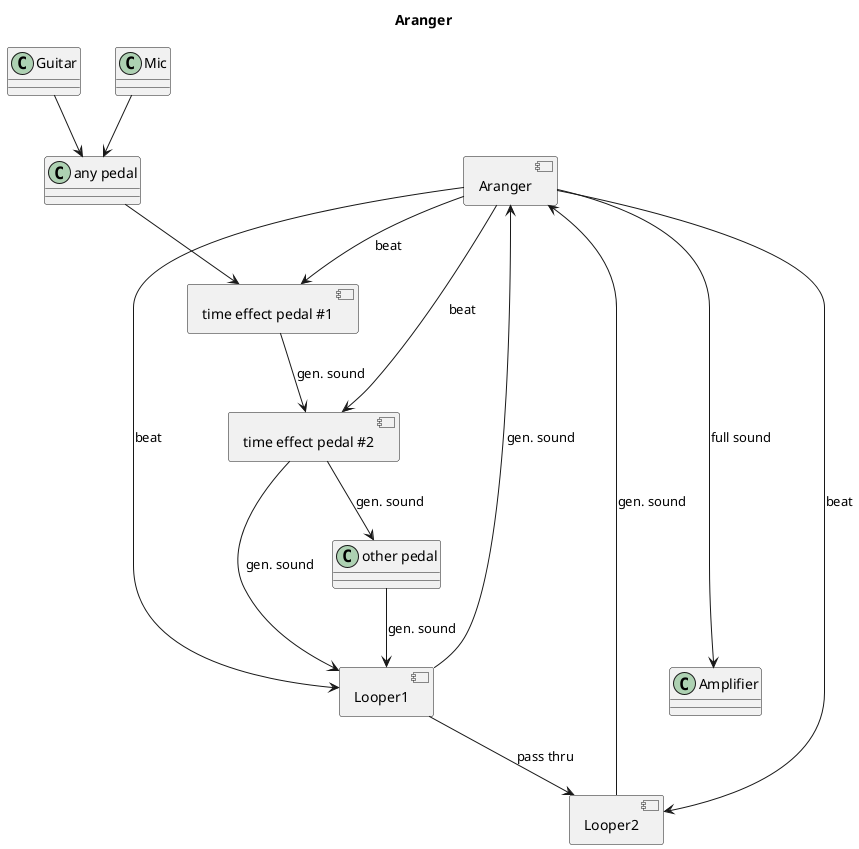

Aranger
===

The Aranger is a module used share a tempo between  
  * looper modules to ease loop synching
  * time effect pedals such as a delay, flanger, tremolo, drum simulator, ...
It also gathers mixed volumes from loopers

