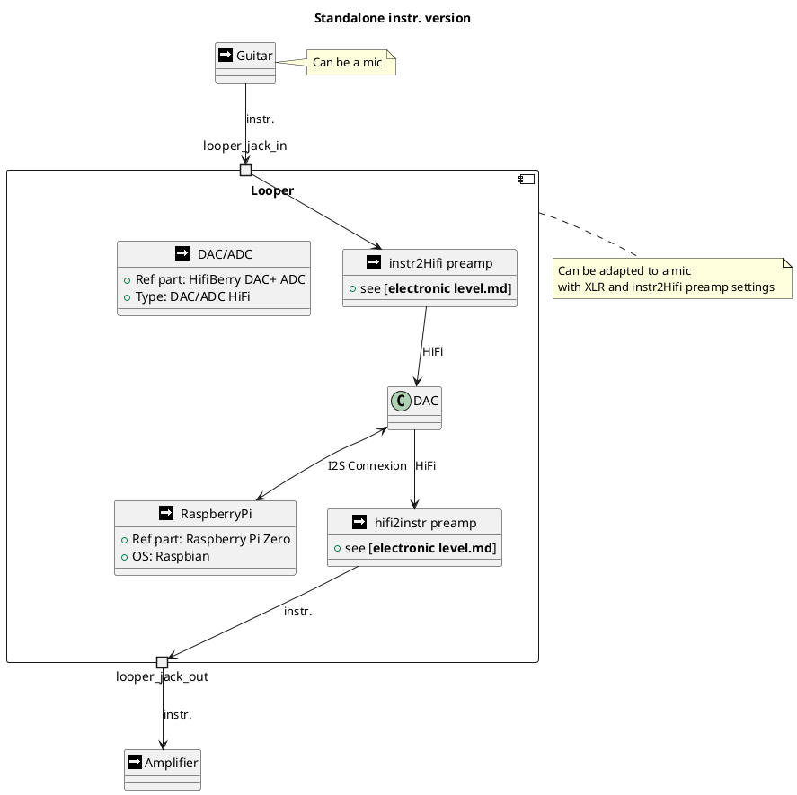
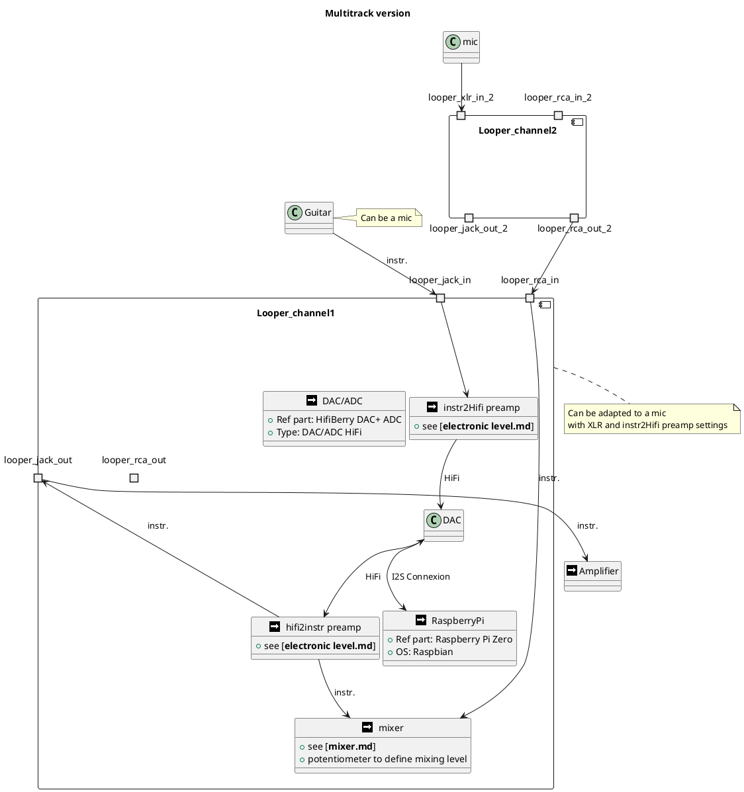

Architecture
===

# Standalone instr. version
The looper can be in different flavors: instrument or microphone.
The mic version should include a 48V phantom power supply.

> __NOTE__
> 
> To spare DAC, Raspberry and extra casing, an input mixer/preamp realised with a simple opamp could be added.

The RaspberryPi component hosts many features :
* managing loops (start, stop, erase, overdub, ...)
* applying sound effects (delay, reverb, distortion, ...)
* generating a metronome beep

# Multitrack version
This version enables multitracking that can be run or paused separately.

The connection between loopers modules requires robust mechanical links to firmly chain modules.
The connection can be used to:
* enable a unique link to an amplifier - therefore mixing capabilities must be added to each module
* a [Arranger](arranger.md) could be used to share a tempo between  
  * looper modules to ease loop synching
  * time effect pedals such as a delay, flanger, tremolo, drum simulator, ...

# Wireless version
Beside the pedals before the looper system, both multitracks and [arranger](arranger.md) can communicate through wireless protocols:
* WiFi for the sound: 
  * Bandwidth Required: Approximately 9.216 Mbps for a 24-bit, 192 kHz stereo audio signal.
  * The maximum theoretical data rate for 802.11n can reach up to 600 Mbps on the Raspberry Pi Zero 2 W
* Bluetooth for time synching
  * Maximum Theoretical Bandwidth: Bluetooth 5.0 can achieve data rates of up to 2 Mbps on the Raspberry Pi Zero 2 W

This wireless version would then enable each musician to control their own loops and effects, the arranger could then be split into
* a mixing module (for the sound engineer to control the balance)
* a drum module (for the drummer to set the tempo at start - an internal mic would listen to the sticks start and time signature or something like that...)