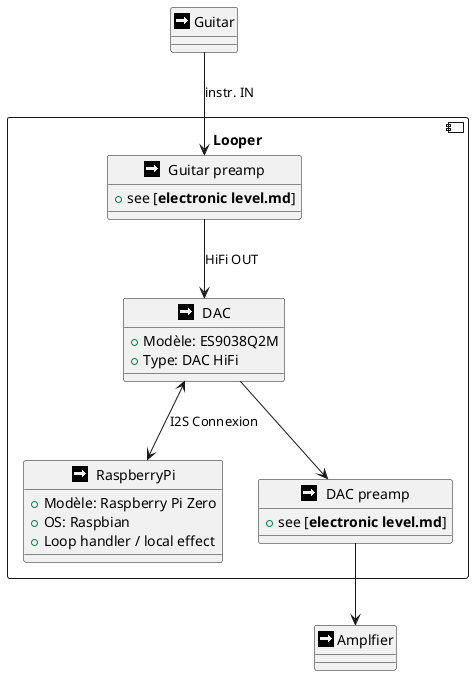
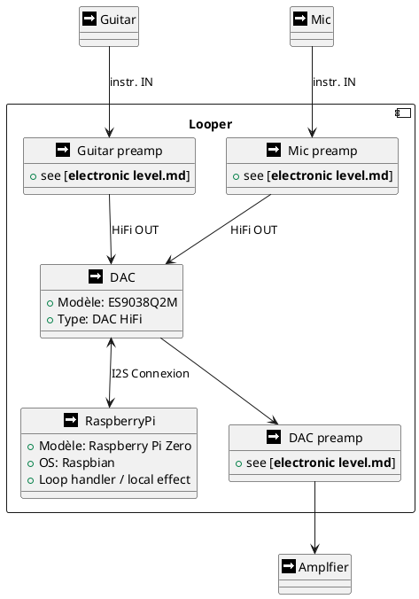

Architecture
===

# Standalone version

```plantuml
@startuml
sprite $part [16x16/16] {
FFFFFFFFFFFFFFFF
FFFFFFFFFFFFFFFF
FFFFFFFFFFFFFFFF
FFFFFFFFFFFFFFFF
FFFFFFFFFF0FFFFF
FFFFFFFFFF00FFFF
FF00000000000FFF
FF000000000000FF
FF00000000000FFF
FFFFFFFFFF00FFFF
FFFFFFFFFF0FFFFF
FFFFFFFFFFFFFFFF
FFFFFFFFFFFFFFFF
FFFFFFFFFFFFFFFF
FFFFFFFFFFFFFFFF
FFFFFFFFFFFFFFFF
}

!define RECTANGLE class

component Looper {
    RECTANGLE RaspberryPi  <<$part>> {
        + Modèle: Raspberry Pi Zero
        + OS: Raspbian
        + Loop handler / local effect
    }
    
    RECTANGLE DAC  <<$part>> {
        + Modèle: ES9038Q2M
        + Type: DAC HiFi
    }
    
    RECTANGLE "Guitar preamp"  <<$part>> {
        + see [**electronic level.md**]
    }
    
    RECTANGLE "DAC preamp"  <<$part>> {
        + see [**electronic level.md**]
    }
}

RECTANGLE Guitar  <<$part>> 
RECTANGLE Amplfier  <<$part>>

DAC --> "DAC preamp"
"DAC preamp" --> Amplfier
DAC <--> RaspberryPi : I2S Connexion
"Guitar preamp" --> DAC : HiFi OUT
Guitar -->  "Guitar preamp" : instr. IN

@enduml
```

# Multichannel standalone version

```plantuml
@startuml
sprite $part [16x16/16] {
FFFFFFFFFFFFFFFF
FFFFFFFFFFFFFFFF
FFFFFFFFFFFFFFFF
FFFFFFFFFFFFFFFF
FFFFFFFFFF0FFFFF
FFFFFFFFFF00FFFF
FF00000000000FFF
FF000000000000FF
FF00000000000FFF
FFFFFFFFFF00FFFF
FFFFFFFFFF0FFFFF
FFFFFFFFFFFFFFFF
FFFFFFFFFFFFFFFF
FFFFFFFFFFFFFFFF
FFFFFFFFFFFFFFFF
FFFFFFFFFFFFFFFF
}

!define RECTANGLE class
component Looper {
    RECTANGLE RaspberryPi  <<$part>> {
        + Modèle: Raspberry Pi Zero
        + OS: Raspbian
        + Loop handler / local effect
    }
    
    RECTANGLE DAC  <<$part>> {
        + Modèle: ES9038Q2M
        + Type: DAC HiFi
    }
    
    RECTANGLE "Mic preamp"  <<$part>> {
        + see [**electronic level.md**]
    }
    
    RECTANGLE "Guitar preamp"  <<$part>> {
        + see [**electronic level.md**]
    }
    
    RECTANGLE "DAC preamp"  <<$part>> {
        + see [**electronic level.md**]
    }
}


RECTANGLE Guitar  <<$part>> 
RECTANGLE Mic  <<$part>> 

RECTANGLE Guitar  <<$part>> 
RECTANGLE Amplfier  <<$part>>

DAC --> "DAC preamp"
"DAC preamp" --> Amplfier
DAC <--> RaspberryPi : I2S Connexion
"Guitar preamp" --> DAC : HiFi OUT
"Mic preamp" --> DAC : HiFi OUT
Guitar -->  "Guitar preamp" : instr. IN
Mic -->  "Mic preamp" : instr. IN

@enduml
```

# Multichannel multitrack version

```plantuml
@startuml
sprite $part [16x16/16] {
FFFFFFFFFFFFFFFF
FFFFFFFFFFFFFFFF
FFFFFFFFFFFFFFFF
FFFFFFFFFFFFFFFF
FFFFFFFFFF0FFFFF
FFFFFFFFFF00FFFF
FF00000000000FFF
FF000000000000FF
FF00000000000FFF
FFFFFFFFFF00FFFF
FFFFFFFFFF0FFFFF
FFFFFFFFFFFFFFFF
FFFFFFFFFFFFFFFF
FFFFFFFFFFFFFFFF
FFFFFFFFFFFFFFFF
FFFFFFFFFFFFFFFF
}

!define RECTANGLE class

component Looper {
    RECTANGLE RaspberryPi  <<$part>> {
        + Modèle: Raspberry Pi Zero
        + OS: Raspbian
        + Loop handler / local effect
    }
    
    RECTANGLE DAC  <<$part>> {
        + Modèle: ES9038Q2M
        + Type: DAC HiFi
    }
    
    RECTANGLE "Mic preamp"  <<$part>> {
        + see [**electronic level.md**]
    }
    
    RECTANGLE "Guitar preamp"  <<$part>> {
        + see [**electronic level.md**]
    }
    
    RECTANGLE "DAC preamp"  <<$part>> {
        + see [**electronic level.md**]
    }
}

RECTANGLE Guitar  <<$part>> 
RECTANGLE Mic  <<$part>> 

RECTANGLE Guitar  <<$part>> 
RECTANGLE Amplfier  <<$part>>

DAC --> "DAC preamp"
"DAC preamp" --> Amplfier
DAC <--> RaspberryPi : I2S Connexion
"Guitar preamp" --> DAC : HiFi OUT
"Mic preamp" --> DAC : HiFi OUT
Guitar -->  "Guitar preamp" : instr. IN
Mic -->  "Mic preamp" : instr. IN

@enduml
```