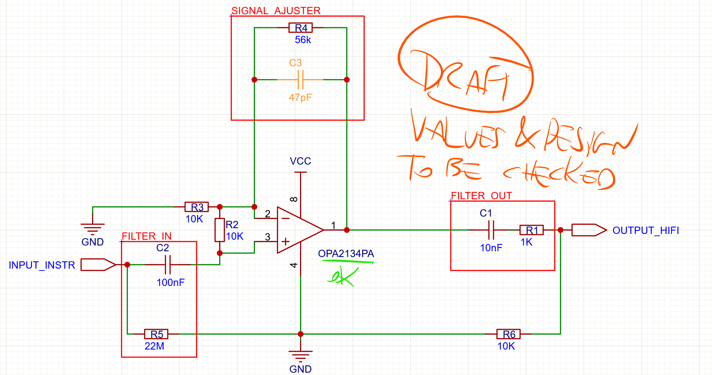

Signals caracteristics
===
# Signal types
## Musical Instrument Signal
* **Signal Type**: Generally analog.
* **Signal Level**:
  * *Electric Guitar*: Approximately -10 dBV to -20 dBV.
  * *Microphone*: Typically around -60 dBV to -40 dBV (for dynamic microphones).
* **Impedance**:
  * *Guitar*: About 10 kΩ to 20 kΩ (high impedance).
  * *Microphone*: Ranges from 150 Ω to 600 Ω (low impedance).
* **Frequency Response**:
        Varies by instrument, typically from 20 Hz to 20 kHz for acoustic instruments.
* **Signal Characteristics**:
        Can exhibit significant dynamic range variations, with peaks during loud play.
        Often requires a preamplifier to boost the signal level before further processing.

To handle such signal, sound cards such as
* M-Audio M-Track Duo
* Behringer UMC22
Those cards are audio USB "class compliant".

## Hi-Fi Audio Signal
* **Signal Type**: Generally analog, but can also be digital (in modern systems).
* **Signal Level**:
  * *Line Level*: Approximately +4 dBu for professional equipment and -10 dBV for consumer equipment.
* *Impedance**:
        Hi-Fi Equipment: Ranges from about 1 kΩ to 10 kΩ (high impedance for inputs).
* **Frequency Response**:
        Typically from 20 Hz to 20 kHz, but can extend to 40 kHz or more for high-fidelity systems.
* *Signal Characteristics**:
        Less subject to extreme dynamic range variations.
        Designed for faithful sound reproduction, with a high signal-to-noise ratio.

To handle such signal, Raspberry cards such as
* [Raspberry Pi ES9038Q2M HiFi DAC Pro Hat](https://www.inno-maker.com/wp-content/uploads/2022/09/HIFI-DAC-Pro-User-ManualV1.0.pdf)
* [innomaker Raspberry Pi extension card PCM5122 HiFi DAC](http://www.inno-maker.com/wp-content/uploads/2017/11/HIFI-DAC-User-Manual-V1.2.pdf)

# Signal transformation
Here are some specific electronic component references that can be used for converting between instrument signals and Hi-Fi signals:
   * **TL072**: A low-noise JFET-input operational amplifier, commonly used in audio applications. Good for general applications, but may have slightly lower performance in terms of noise and distortion compared to the OPA2134PA.
   * **OPA2134**: A high-performance audio op-amp suitable for preamplification. Ideal for high-fidelity audio applications, with wider bandwidth and lower harmonic distortion.
  
> To discover more on signal transformation watch this tutorial :
> * https://www.youtube.com/watch?v=Lfus8ew0udY
> * https://fr.wikipedia.org/wiki/Montages_de_base_de_l%27amplificateur_op%C3%A9rationnel
> * http://mawy33.free.fr/cours%20sup/32-008%20%C3%A9l%C3%A9ctrocin%C3%A9tique%20imp%C3%A9dance%20entr%C3%A9e%20sortie.pdf
> * https://forum.arduino.cc/t/guitar-input-with-op-amp-not-giving-output/1081889/13

Example of electronic design:
.
(edited with https://pro.easyeda.com)

## General Components

   * Resistors: Use standard 1/4W or 1/8W resistors for creating attenuators and filters (e.g., 1kΩ, 10kΩ).
   * Capacitors: Ceramic or electrolytic capacitors for filtering applications (e.g., 10µF, 100nF).
