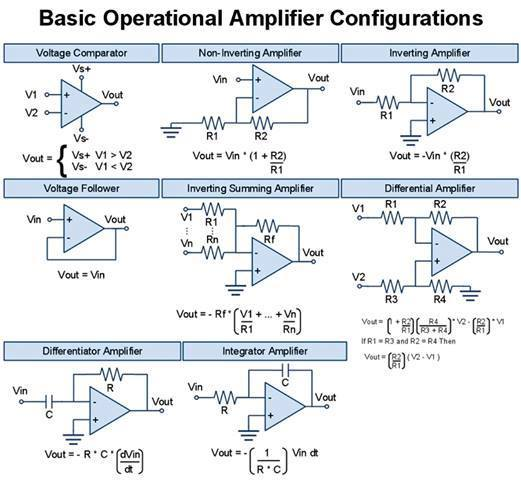
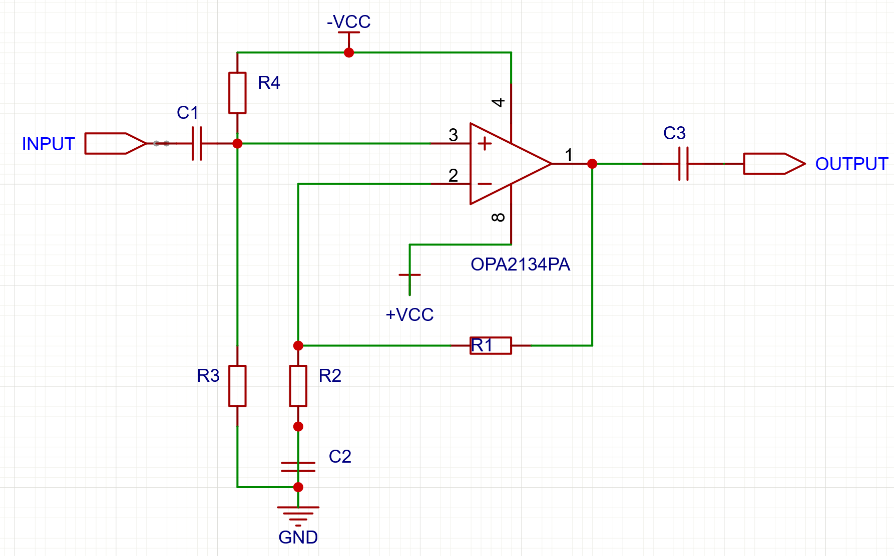
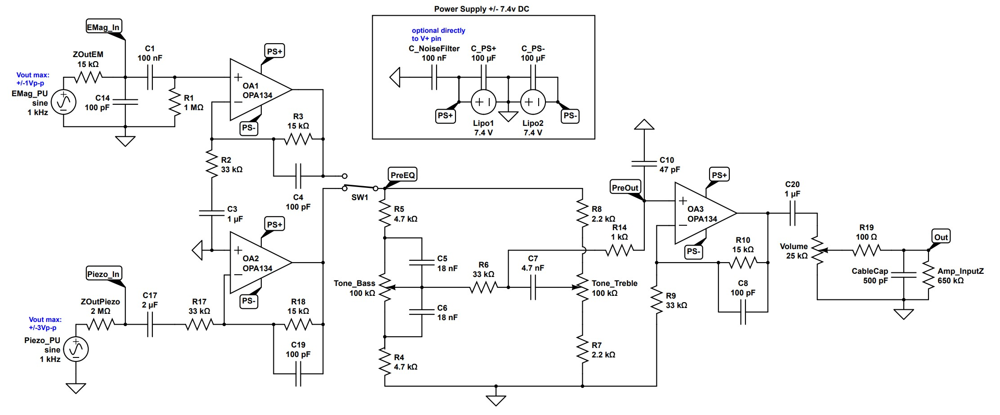

Signals caracteristics
===
# Signal types
## Musical Instrument Signal
* **Signal Type**: Generally analog.
* **Signal Level**:
  * *Electric Guitar*: Approximately -10 dBV to -20 dBV.
  * *Microphone*: Typically around -60 dBV to -40 dBV (for dynamic microphones).
* **Impedance**:
  * *Guitar*: About 10 kΩ to 20 kΩ (high impedance).
  * *Microphone*: Ranges from 150 Ω to 600 Ω (low impedance).
* **Frequency Response**:
        Varies by instrument, typically from 20 Hz to 20 kHz for acoustic instruments.
* **Signal Characteristics**:
        Can exhibit significant dynamic range variations, with peaks during loud play.
        Often requires a preamplifier to boost the signal level before further processing.

To handle such signal, sound cards such as
* M-Audio M-Track Duo
* Behringer UMC22
Those cards are audio USB "class compliant".

## Hi-Fi Audio Signal
* **Signal Type**: Generally analog, but can also be digital (in modern systems).
* **Signal Level**:
  * *Line Level*: Approximately +4 dBu for professional equipment and -10 dBV for consumer equipment.
* *Impedance**:
        Hi-Fi Equipment: Ranges from about 1 kΩ to 10 kΩ (high impedance for inputs).
* **Frequency Response**:
        Typically from 20 Hz to 20 kHz, but can extend to 40 kHz or more for high-fidelity systems.
* *Signal Characteristics**:
        Less subject to extreme dynamic range variations.
        Designed for faithful sound reproduction, with a high signal-to-noise ratio.

To handle such signal, Raspberry cards such as
* [Raspberry Pi ES9038Q2M HiFi DAC Pro Hat](https://www.inno-maker.com/wp-content/uploads/2022/09/HIFI-DAC-Pro-User-ManualV1.0.pdf)
* [innomaker Raspberry Pi extension card PCM5122 HiFi DAC](http://www.inno-maker.com/wp-content/uploads/2017/11/HIFI-DAC-User-Manual-V1.2.pdf)

# Signal transformation
Here are some specific electronic component references that can be used for converting between instrument signals and Hi-Fi signals:
   * **TL072**: A low-noise JFET-input operational amplifier, commonly used in audio applications. Good for general applications, but may have slightly lower performance in terms of noise and distortion compared to the OPA2134PA.
   * **OPA2134**: A high-performance audio op-amp suitable for preamplification. Ideal for high-fidelity audio applications, with wider bandwidth and lower harmonic distortion.

## Theory

To transform a mic signal into a guitar level signal, we shoud use a "Non-Inverting Amplifier":

With 
> Vout = Vin(1+R1/R2)

## Real life schema
Filters are usually inserted between IC and IO: 
Thus, with an OA such as TI's [OPA2134PA](https://www.ti.com/lit/ds/symlink/opa2134.pdf), the schema would be:

To adapt the signal level of a dynamic microphone (approximately -60 dBV to -40 dBV) to the level of a guitar signal (approximately -10 dBV to -20 dBV), you will need to increase the gain of your amplifier. Here’s how you can determine the values of R1 and R2.

### Gain calculation

1. **Signal Levels**:
   - Microphone: -60 dBV to -40 dBV
   - Guitar: -10 dBV to -20 dBV

2. **Level Difference**:
   - To adapt the microphone signal to the highest guitar level (-10 dBV), you will need a gain of around 50 dB (since 50 dB corresponds to a ratio of 100,000 times in voltage).

#### Required Gain

To convert -60 dBV to -10 dBV, the difference is 50 dB. In terms of gain:

> Gain = 10^(50/20) ~ _approx 100_ 
>
> which means _100 times_

#### Gain Formula
For a non-inverting amplifier:
> A = 1 + R1/R2

### Choosing Values
To achieve a gain of 100:
> 100 = 1 + R1/R2
This means:
> R1/R2 = 99

#### Example Values

- If you choose **R2 = 1 kΩ**:
  - Then R1 = 99 kΩ (you can use a nearby resistance, like 100 kΩ).

- If you choose **R2 = 10 kΩ**:
  - Then R1 = 990 kΩ (you can use a combination of resistors to achieve this value).

### High-pass filters
You could note the INPUT is plugged to a condensor (C1) with its other pin plugged to resistors (R3 or R4).
These are typically [High-pass filters](https://en.wikipedia.org/wiki/High-pass_filter).

To cut frequencies under 20Hz, the classic formulae is 
> Fc = 1 / (2 * PI * R * C)
 
Which can be implemented with 
* R = 80 kOhm
* C = 100 nF

Similarly, a [low-pass filter](https://en.wikipedia.org/wiki/Low-pass_filter) could be added to cut frequencies higher than 20 kHz with the same calculation.

### Peak detector

### Gain control

### EQ

## See also  
> To discover more on signal transformation watch this tutorial :
> * https://www.youtube.com/watch?v=Lfus8ew0udY
> * https://fr.wikipedia.org/wiki/Montages_de_base_de_l%27amplificateur_op%C3%A9rationnel
> * http://mawy33.free.fr/cours%20sup/32-008%20%C3%A9l%C3%A9ctrocin%C3%A9tique%20imp%C3%A9dance%20entr%C3%A9e%20sortie.pdf
> * https://forum.arduino.cc/t/guitar-input-with-op-amp-not-giving-output/1081889/13
>
> the most advanced work on this is probably https://electronics.stackexchange.com/questions/607840/best-way-to-reduce-hf-noise-in-oma2134-op-amp-preamp-circuit/610271#610271
> 
> 

## General Components

   * Resistors: Use standard 1/4W or 1/8W resistors for creating attenuators and filters (e.g., 1kΩ, 10kΩ).
   * Capacitors: Ceramic or electrolytic capacitors for filtering applications (e.g., 10µF, 100nF).
