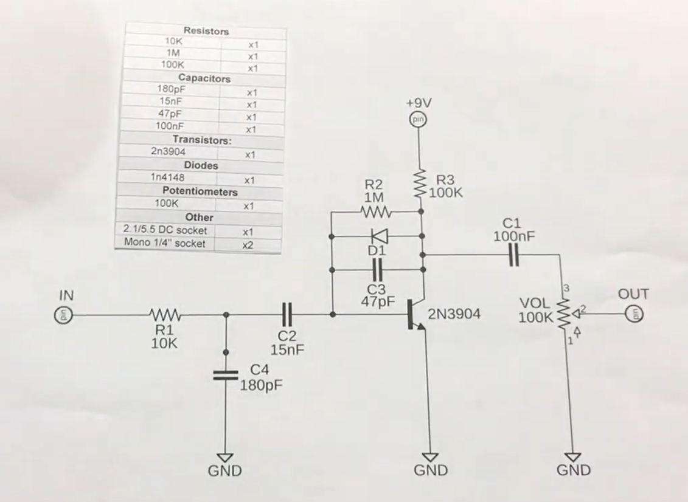

Distortion
===

To control the level of distortion more precisely in an audio effect, you can use a number of techniques. Here are a few approaches that can help you adjust and fine-tune distortion:

# Main parameters
## Gain control
Gain is a major parameter influencing the level of distortion. By adjusting gain, you can control the amount of saturation applied to the signal. Use dynamic control to vary gain as needed.
 
## Clipping threshold
By setting a more precise clipping threshold, you can determine the point at which the signal starts to become saturated. This allows you to control the amount of distortion applied.

## Distortion depth
Some distortion functions may include a depth parameter that determines the point at which the signal is distorted. For example, in a soft clipping effect, you can adjust the function to be more or less aggressive.

## Using Filters
Before applying distortion, you can filter certain frequencies of the signal. By using an equalizer, you can boost or attenuate specific frequency ranges, thus influencing the way distortion manifests itself.

## Dynamic distortion
Apply dynamic distortion that changes with the level of the input signal. This may involve using compression or expansion before applying the distortion.


# Complex distortions
To add other types of distortion to an audio signal, you can experiment with different signal processing techniques.
Here are some common approaches you can incorporate into your code to achieve various distortion effects:

## Soft clipping distortion
Soft clipping is a gentler method that uses a non-linear function to smooth the signal instead of cutting it off abruptly.

```python
def soft_clipping(signal, gain=5.0):
    signal = signal * gain
    return np.tanh(signal)  # Hyperbolic tangential function for soft clippingpython
```

## Overdrive
Overdrive is a type of distortion where the signal is amplified and then saturated. 
You can simulate this with high gain followed by clipping.

```python
def overdrive(signal, gain=5.0, threshold=0.5):
    signal = signal * gain
    return np.clip(signal, -threshold, threshold)
```

# 3. Fuzz
Fuzz creates a very saturated, rough sound. It's often used in electric guitars.

```python
def fuzz(signal, gain=5.0):
    signal = signal * gain
    return np.sign(signal) * (np.abs(signal) ** 2)  # Raise squared for fuzz
```

## Distortion by Equalization

You can also apply distortion by using an equalizer to accentuate certain frequencies before clipping them.

```python
def eq_distortion(signal, gain=5.0, threshold=0.3):
    # Apply gain to certain frequency bands (e.g.: EQ effect)
    # This would require a filter, but for the example, we'll simply implement it
    signal = signal * gain
    # Clipping
    return np.clip(signal, -threshold, threshold)
```

# 5. Combining techniques

You can also combine several distortion techniques to create a more complex effect.

# Full electronic version

from [Tone Charm Audio](https://www.youtube.com/watch?v=RXIqUyW2syU)