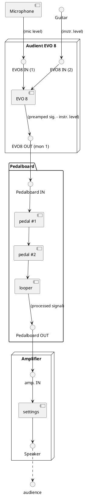
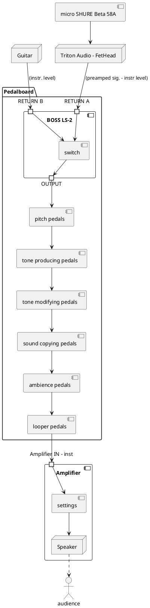

Studio Configuration
===

# Version 1 - soundcard-based

```plantuml
@startuml soundboardBased

package "Pedalboard" {
  "Pedalboard IN" --> [pedal #1]
  [pedal #1] --> [pedal #2]
  [pedal #2] --> [looper]
  [looper] --> "Pedalboard OUT" : "(processed signal)"
}

node "Audient EVO 8" {
  "EVO8 IN (1)" --> [EVO 8] 
  "EVO8 IN (2)" --> [EVO 8]
  [EVO 8] --> "EVO8 OUT (mon 1)" : "(preamped sig. - instr. level)"
}

node "Amplifier" {
  "amp. IN" --> [settings]
  [settings] --> "Speaker"
}

[Microphone] --> "EVO8 IN (1)" : "(mic level)"
"Guitar" --> "EVO8 IN (2)" : "(instr. level)"
"EVO8 OUT (mon 1)" --> "Pedalboard IN"
"Pedalboard OUT" --> "amp. IN"
"Speaker" ..> audience

@enduml
```

# Version 2 - standalone

```plantuml
@startuml standalone


component "Amplifier" {
  portin "Amplifier IN - inst"
  "Amplifier IN - inst" --> [settings]
  node "Speaker"
  [settings] --> "Speaker"
}


node "Triton Audio - FetHead" {

}

package "Pedalboard" {
    component "BOSS LS-2" {
      portin "RETURN A"
      portin "RETURN B"
      portout "OUTPUT"
      "RETURN A" --> [switch]
      "RETURN B" --> [switch]
      [switch] --> "OUTPUT"
    }
  [pitch pedals] --> [tone producing pedals]
  [tone producing pedals] --> [tone modifying pedals]
  [tone modifying pedals] --> [sound copying pedals]
  [sound copying pedals] --> [ambience pedals]
  [ambience pedals] --> [looper pedals]
}
node "Guitar" 
actor audience

[micro SHURE Beta 58A] --> "Triton Audio - FetHead"
 "Triton Audio - FetHead" --> "RETURN A" : "(preamped sig. - instr level)"
"Guitar" --> "RETURN B" : "(instr. level)"
"OUTPUT" --> [pitch pedals]
[looper pedals] --> "Amplifier IN - inst"
"Speaker" ..> audience

@enduml
```

